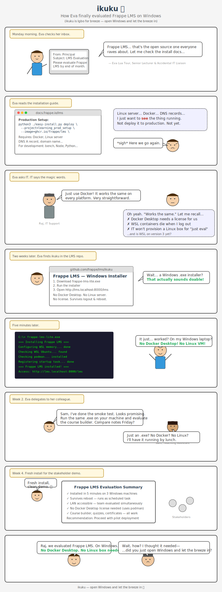

# Frappe LMS — Windows Installer

One-click Windows installer for [Frappe LMS](https://github.com/frappe/lms). Runs the full stack (MariaDB, Redis, Frappe) inside WSL2 + podman — no Docker Desktop, no Linux VM, no manual setup.

> *ikuku* (in Igbo - Nigeria  means *breeze* ) — open Windows and let the breeze in.

<p align="center">
  <a href="webcomic-eva-ikuku.svg">
    
  </a>
</p>

## Quick Start

1. Download `frappe-lms-lite.exe` from [Releases](../../releases)
2. Run the installer (needs admin rights + internet)
3. Open `http://lms.localhost:8000/lms`

That's it. Frappe LMS is running as a Windows service — survives reboots, accessible from LAN.

## Variants

| Installer | Size | Use case |
|-----------|------|----------|
| `frappe-lms-lite.exe` | ~5 MB | PC has internet — downloads WSL, Ubuntu, containers during install |
| `frappe-lms-full.exe` | ~1.5 GB | Offline LAN — bundles WSL MSI, Ubuntu appx, container images |

## How it works

```
┌─────────────────────────────────────────┐
│  Windows 10/11 or Server 2022           │
│                                         │
│  ┌─────────────────────────────────┐    │
│  │  WSL2 Ubuntu                    │    │
│  │  ┌───────────┐ ┌─────────┐     │    │
│  │  │ MariaDB   │ │  Redis  │     │    │
│  │  └───────────┘ └─────────┘     │    │
│  │  ┌───────────────────────┐     │    │
│  │  │  Frappe LMS (:8000)   │     │    │
│  │  └───────────────────────┘     │    │
│  └─────────────────────────────────┘    │
│                                         │
│  FrappeLMS service (auto-start)         │
│  Port proxy: LAN:port → WSL:8000       │
│  Sleep mode: disabled                   │
└─────────────────────────────────────────┘
```

## Access

- Local: `http://lms.localhost:8000/lms`
- LAN: `http://<machine-name>:8000/lms`
- Admin: `http://lms.localhost:8000` (Frappe desk)

## Scripts

For power users who prefer scripts over the installer:

```powershell
powershell -ExecutionPolicy Bypass -File install.ps1   # install
powershell -ExecutionPolicy Bypass -File start.ps1     # start service
powershell -ExecutionPolicy Bypass -File stop.ps1      # stop service
powershell -ExecutionPolicy Bypass -File uninstall.ps1 # remove everything
```

## Uninstall

Control Panel → Add/Remove Programs → "Frappe LMS" → Uninstall

Or run: `powershell -File "C:\Program Files\FrappeLMS\uninstall.ps1"`

## Requirements

- Windows 10 (build 19041+), Windows 11, or Windows Server 2022
- Hardware virtualization enabled (for WSL2)
- 16 GB RAM recommended (WSL gets 12 GB)
- Admin rights for install

## Building

```powershell
# Lite (downloads everything during install)
powershell -File build-installer.ps1 -Variant lite

# Full (offline, bundles all dependencies)
powershell -File build-installer.ps1 -Variant full
```

Requires [NSIS](https://nsis.sourceforge.io/) installed.
